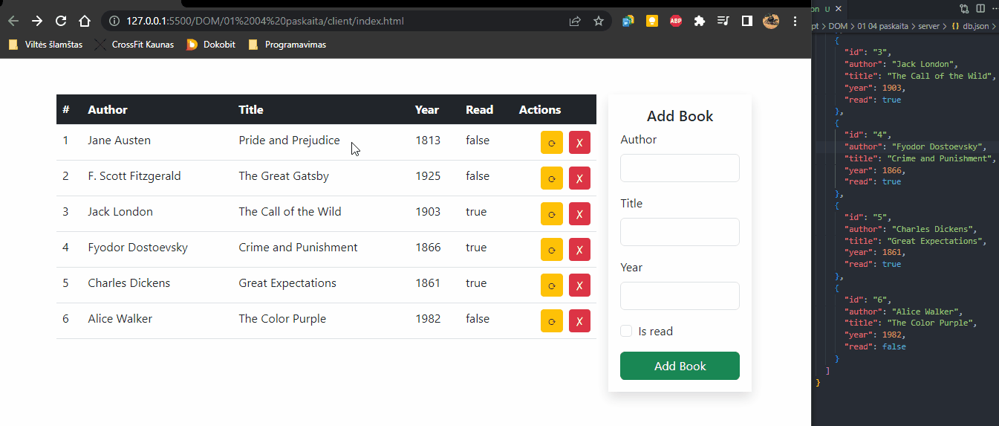

# Fullstack CRUD aplication

Program files are devided in 2 folders: client and server.
Server folder has it's own instrction in __readme.md__ file;

## Aplication example

## Request examples
Request examples can be viewed using [Postman](https://www.postman.com/downloads/). Request examples are given in [Postman File]()
